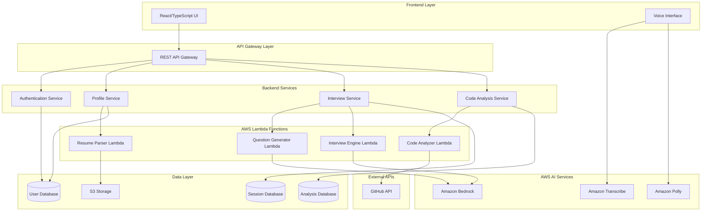

# Design Document: Personalized Mock Interview System

## Overview

The Personalized Mock Interview System is a cloud-native application that provides hyper-personalized technical interview preparation by analyzing users' GitHub repositories and resumes. The system conducts voice-based mock interviews with AI-generated questions specific to each user's actual code and project decisions.

The architecture leverages AWS services for speech processing and AI capabilities, with a React/TypeScript frontend and Node.js/TypeScript backend. The system processes user repositories to understand implementation choices and generates contextual interview questions that simulate real technical interviews.

## Architecture

### High-Level Architecture



### Service Architecture

The system follows a microservices architecture with clear separation of concerns:

- **Frontend Layer**: React/TypeScript SPA with voice interface components
- **API Gateway**: Centralized routing and authentication
- **Backend Services**: Core business logic services
- **Lambda Functions**: Serverless processing for compute-intensive tasks
- **AWS AI Services**: Managed AI/ML capabilities
- **Data Layer**: Persistent storage for different data types

## Components and Interfaces

### Frontend Components

#### InterviewPage Component
```typescript
interface InterviewPageProps {
  userId: string;
  sessionId?: string;
}

interface InterviewState {
  status: 'idle' | 'active' | 'paused' | 'completed';
  currentQuestion: Question;
  transcript: TranscriptEntry[];
  audioPermissions: boolean;
}
```

#### VoiceInterface Component
```typescript
interface VoiceInterfaceProps {
  onTranscription: (text: string) => void;
  onSpeechStart: () => void;
  onSpeechEnd: () => void;
  isListening: boolean;
}

interface AudioConfig {
  sampleRate: number;
  channels: number;
  encoding: 'LINEAR16' | 'FLAC';
}
```

### Backend Service Interfaces

#### Profile Service
```typescript
interface ProfileService {
  createProfile(userId: string, resumeFile: File): Promise<UserProfile>;
  connectGitHub(userId: string, githubToken: string): Promise<GitHubConnection>;
  getProfile(userId: string): Promise<UserProfile>;
  updateProfile(userId: string, updates: Partial<UserProfile>): Promise<UserProfile>;
}

interface UserProfile {
  userId: string;
  resumeData: ResumeData;
  githubRepos: Repository[];
  analysisStatus: 'pending' | 'processing' | 'completed' | 'failed';
  createdAt: Date;
  updatedAt: Date;
}
```

#### Interview Service
```typescript
interface InterviewService {
  startInterview(userId: string, preferences: InterviewPreferences): Promise<InterviewSession>;
  processResponse(sessionId: string, response: string): Promise<InterviewResponse>;
  pauseInterview(sessionId: string): Promise<void>;
  endInterview(sessionId: string): Promise<InterviewSummary>;
}

interface InterviewSession {
  sessionId: string;
  userId: string;
  status: SessionStatus;
  questions: Question[];
  responses: Response[];
  startTime: Date;
  duration: number;
}
```

#### Code Analysis Service
```typescript
interface CodeAnalysisService {
  analyzeRepositories(userId: string, repos: Repository[]): Promise<AnalysisResult>;
  getAnalysis(userId: string): Promise<AnalysisResult>;
  refreshAnalysis(userId: string): Promise<AnalysisResult>;
}

interface AnalysisResult {
  userId: string;
  repositories: RepositoryAnalysis[];
  techStack: TechnologyStack;
  complexity: ComplexityMetrics;
  projectTypes: ProjectType[];
  analysisDate: Date;
}
```

### Lambda Function Interfaces

#### Resume Parser Lambda
```typescript
interface ResumeParserInput {
  userId: string;
  fileUrl: string;
  fileType: 'pdf' | 'doc' | 'docx';
}

interface ResumeParserOutput {
  personalInfo: PersonalInfo;
  education: Education[];
  experience: WorkExperience[];
  projects: Project[];
  skills: Skill[];
  extractionConfidence: number;
}
```

#### Code Analyzer Lambda
```typescript
interface CodeAnalyzerInput {
  userId: string;
  repositories: GitHubRepository[];
  analysisDepth: 'shallow' | 'deep';
}

interface CodeAnalyzerOutput {
  repositoryAnalyses: RepositoryAnalysis[];
  overallMetrics: CodeMetrics;
  technicalDecisions: TechnicalDecision[];
  architecturalPatterns: ArchitecturalPattern[];
}
```

## Data Models

### User and Profile Models

```typescript
interface User {
  userId: string;
  email: string;
  name: string;
  createdAt: Date;
  lastLoginAt: Date;
  subscriptionTier: 'free' | 'premium';
}

interface ResumeData {
  personalInfo: PersonalInfo;
  education: Education[];
  workExperience: WorkExperience[];
  projects: Project[];
  skills: Skill[];
  extractedAt: Date;
}

interface PersonalInfo {
  name: string;
  email: string;
  phone?: string;
  location?: string;
  linkedIn?: string;
  portfolio?: string;
}

interface Project {
  name: string;
  description: string;
  technologies: string[];
  duration?: string;
  role?: string;
  achievements?: string[];
  githubUrl?: string;
}
```

### Repository and Analysis Models

```typescript
interface Repository {
  id: string;
  name: string;
  fullName: string;
  description?: string;
  language: string;
  size: number;
  starCount: number;
  forkCount: number;
  lastUpdated: Date;
  isPrivate: boolean;
}

interface RepositoryAnalysis {
  repositoryId: string;
  name: string;
  primaryLanguage: string;
  frameworks: Framework[];
  architecturalPatterns: ArchitecturalPattern[];
  databaseChoices: DatabaseChoice[];
  apiDesigns: ApiDesign[];
  testingApproaches: TestingApproach[];
  deploymentMethods: DeploymentMethod[];
  codeQualityMetrics: CodeQualityMetrics;
}

interface TechnicalDecision {
  category: 'database' | 'framework' | 'architecture' | 'deployment' | 'testing';
  decision: string;
  context: string;
  alternatives: string[];
  reasoning?: string;
  confidence: number;
}
```

### Interview Models

```typescript
interface Question {
  id: string;
  text: string;
  category: QuestionCategory;
  difficulty: 'beginner' | 'intermediate' | 'advanced';
  relatedProject?: string;
  relatedTechnology?: string;
  expectedAnswerPoints: string[];
  followUpQuestions?: string[];
}

interface Response {
  questionId: string;
  userResponse: string;
  transcriptionConfidence: number;
  responseTime: number;
  completeness: number;
  technicalAccuracy: number;
  communicationClarity: number;
}

interface InterviewSummary {
  sessionId: string;
  totalQuestions: number;
  averageResponseTime: number;
  overallScore: number;
  strengthAreas: string[];
  improvementAreas: string[];
  recommendations: string[];
}
```

### AWS Integration Models

```typescript
interface TranscribeConfig {
  languageCode: 'en-US';
  sampleRateHertz: 16000;
  encoding: 'LINEAR16';
  enableAutomaticPunctuation: true;
  vocabularyName?: string;
}

interface PollyConfig {
  voiceId: 'Joanna' | 'Matthew' | 'Amy';
  outputFormat: 'mp3' | 'ogg_vorbis';
  sampleRate: '22050' | '16000';
  textType: 'text' | 'ssml';
}

interface BedrockPrompt {
  model: 'anthropic.claude-v2' | 'ai21.j2-ultra';
  prompt: string;
  maxTokens: number;
  temperature: number;
  context: InterviewContext;
}
```

Now I need to use the prework tool to analyze the acceptance criteria before writing the Correctness Properties section.

<function_calls>
<invoke name="prework">
<parameter name="featureName">personalized-mock-interview